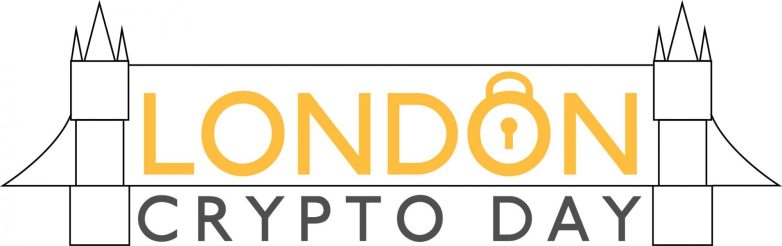
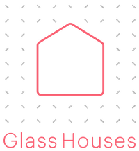
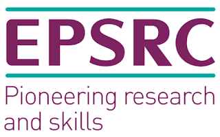

## Important Announcement

**Due to the Covid-19 outbreak the LCD on April 3rd, 2020 will not take place. We are currently working on finding an alternative date for fall 2020 and announce it here as soon as the new date has been decided.**

## What?

London Crypto Day is a full day of talks and discussion about cryptography.
The event aims to provide interesting talk content, and create a space for
cryptographers and cryptography enthusiasts alike to come together and network
with like-minded people, who are either working or interested in similar areas
to themselves.

The event includes a selection of talks from both academia and industry,
participation is free, and there will be plenty of time to socialize and network
with other attendees.

## Where?

Google London, [1-13 St Giles High St, London WC2H 8AG, UK](https://goo.gl/maps/SgJMSMcr1qzKRgh16)

## When?

~~Friday, April 3rd, 2020, starting at 10:00am.~~

Fall 2020, exact date tbd.

## Sounds great, I'm in!

Registration will re-open once the new date has been decided.

## Speakers

* [Martin R. Albrecht](https://malb.io/), Royal Holloway
* [Jens Groth](https://www.linkedin.com/in/jens-groth-a95672/), Dfinity
* [Mary Maller](http://www0.cs.ucl.ac.uk/staff/M.Maller/), Ethereum Foundation
* [Thyla van der Merwe](https://twitter.com/thylavdmerwe), Mozilla
* [Ewa Syta](http://ewa.syta.us/), Trinity College
* [Anastasiia Voitova](https://twitter.com/vixentael), Cossack Labs

## Agenda (Tentative)

* 10:00 - 10:45 Talk 1
* 10:45 - 11:30 Talk 2 
* 11:30 - 12:00 Coffee
* 12:00 - 12:45 Talk 3
* 12:45 - 14:15 Lunch
* 14:15 - 15:00 Talk 4
* 15:00 - 15:45 Talk 5
* 15:45 - 16:15 Coffee
* 16:15 - 17:00 Talk 6

## Organizers

* [Al Cutter](https://github.com/AlCutter), Google
* [Philipp Jovanovic](https://philipp.jovanovic.io/), University College London
* [Sarah Meiklejohn](https://smeiklej.com/), University College London and Google Visiting Researcher

## Co-located Events

In case you want even more crypto, the [3rd edition of the ZKProof workshop](https://zkproof.org/events/workshop3/) 
is taking place right after the LCD on April 4-6, 2020, at the IET London: Savoy Place. Check it out!

## Previous Events

* [2019.2](https://londoncryptoday.github.io/2019/)
* [2019.1](https://londoncryptoday19.splashthat.com/)
* [2017](https://londoncryptoday.wordpress.com/)

## Related Events

* [New York Crypto Day](https://nycryptoday.wordpress.com/)
* [Charles River Crypto Day](https://bostoncryptoday.wordpress.com/)
* [DC Area Crypto Day](https://dcareacryptoday.wordpress.com/)
* [Bay Area Crypto Day](https://bacrypto.github.io/)
* [Paris Crypto Day](https://pariscryptoday.github.io/)
* [Greater Tel Aviv Area Crypto Seminar](http://www.cs.tau.ac.il/cseminar/)
* [Tokyo Crypto Day](https://tokyocryptoday.github.io/index.html)

## Sponsors

The LCD 2020 is partially sponsored by the Glass Houses project under EPSRC Grant EP/N028104/1.

